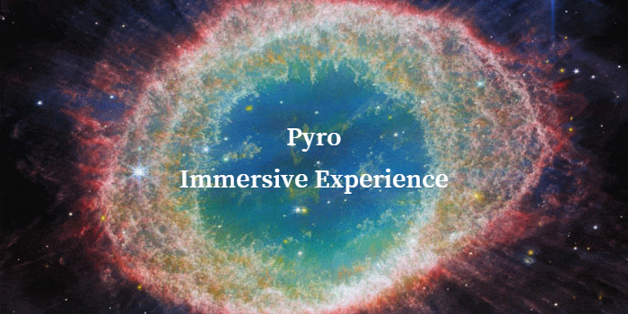

# NASA Space Apps Challenge 2024 [Noida]


[](https://ady37.github.io/Pyro/)

#### Team Name - Pyro
#### Problem Statement - Symphony of the Stars: Harmonizing James Webb Telescope in Music and Images
#### Team Leader Email -1. Registration : 23f3003920@ds.study.iitm.ac.in 2.Github : aditya.yadav.email@gmail.com

## A Brief of the Prototype:

### What is James Webb Telescope?

Webb is the premier observatory of the next decade, serving thousands of astronomers worldwide. It studies every phase in the history of our Universe.
Webb studies every phase in the history of our Universe, ranging from the first luminous glows after the Big Bang, to the formation of solar systems capable of supporting life on planets like Earth, to the evolution of our own Solar System. Webb launched on Dec. 25th 2021. It does not orbit around the Earth like the Hubble Space Telescope, it orbits the Sun 1.5 million kilometers (1 million miles) away from the Earth at what is called the second Lagrange point or L2. 
>"the Webb telescope is a big step in understanding the universe and our origins. "<br>
> _--NASA_

### What is Pyro?

Pyro is creative and immersive website.With its unique design It will help the viewers to look at the images taken by the JWST through a new perspective and it will simulates their minds with its amazing background score designed by combining two tracks.
> "It's not every day you can say you contributed to something that inspires the world in a positive way, but I believe that's what JWST is doing for everyone of all ages" <br>
>  _--Analyn Schneider_

Click [here](https://ady37.github.io/Pyro/) for a breathtaking experience.
## Tech Stack


## Code Execution Instruction:
1.Open the browser
2.Copy and paste the following url in the browser
```https://ady37.github.io/Pyro/```

Click on [demo video ](https://drive.google.com/file/d/1OFb7GgocR7P_257W9i3fmQELgWav1Ova/view?usp=sharing
) to see the website in action